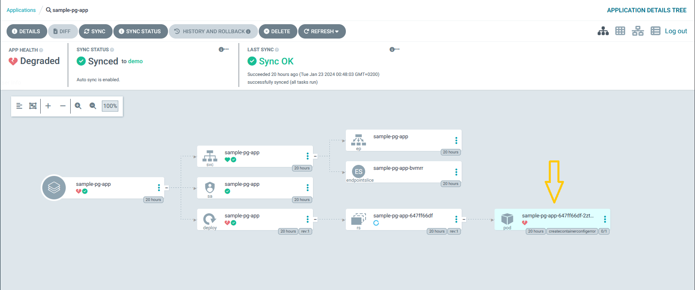
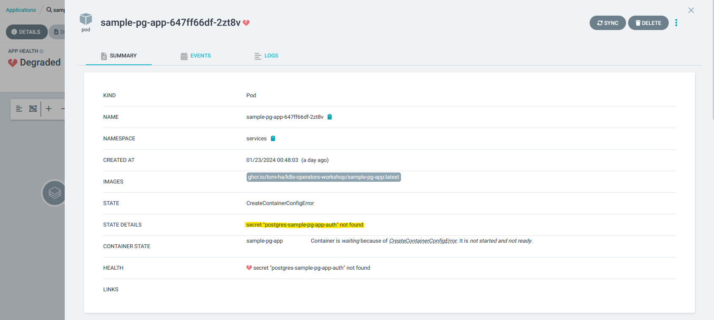

# Create A PostgreSQL Database

After initializing the environment and deploying the root application, in the Argo-CD web UI (see how to access the web UI in the [previous section](../init-env/01_deploy_argocd.md#forward-traffic-to-argo-cd)), you should see the root-app, postgresql, ext-postgres-operator, and sample-pg-app:  


Oh no, the sample-pg-app is not healthy...  

Let's click on the sample-pg and investigate the failing pod:



As you can see, the Pod is missing a Kubernetes Secret:  



Our sample-pg-app is expecting a Kubernetes secret with authentication details to the PostgreSQL database
> [!NOTE]  
> You can check the code and the chart under the [sample-pg-app folder](../sample-pg-app).
  
To fix it, we are going to implement a _Postgres_ CR which will instruct the ext-postgres-operator to provision a new database.  

Add the following `.yaml` to [apps/services/sample-pg-app/hooks](apps/services/sample-pg-app/hooks), then commit and push your changes.  
> [!WARNING]  
> Make sure the file name you choose ends with `.yaml`, for example, `database.yaml`.

```yaml
apiVersion: db.movetokube.com/v1alpha1
kind: Postgres
metadata:
  name: sample-pg-app
  namespace: services
  annotations:
    argocd.argoproj.io/hook: PreSync # Executes prior to the sync operation.
spec:
  database: sample-pg-app # Name of database created in PostgreSQL
  dropOnDelete: false # Set to true if you want the operator to drop the database and role when this CR is deleted (optional)
```


Our sample-pg-app will also need a user name and password for authentication.  
We can declare a new user that will be associated with the database we've created:  

```yaml
apiVersion: db.movetokube.com/v1alpha1
kind: PostgresUser
metadata:
  name: sample-pg-app-auth
  namespace: services
spec:
  role: sample-user
  database: sample-pg-app-db       # This references the Postgres CR
  secretName: postgres
  privileges: OWNER     # Can be OWNER/READ/WRITE
```

