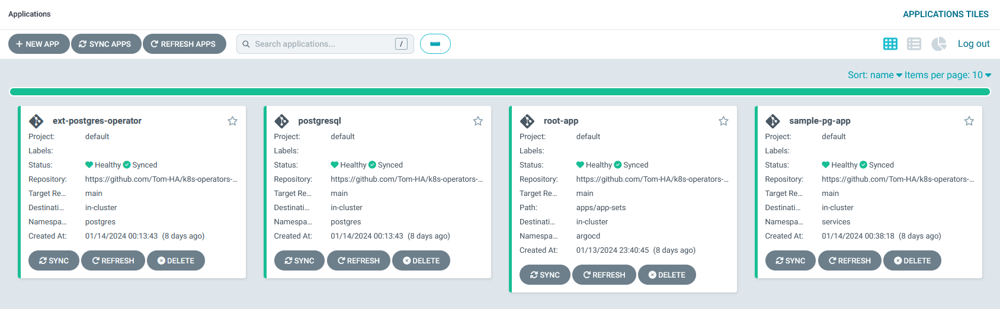
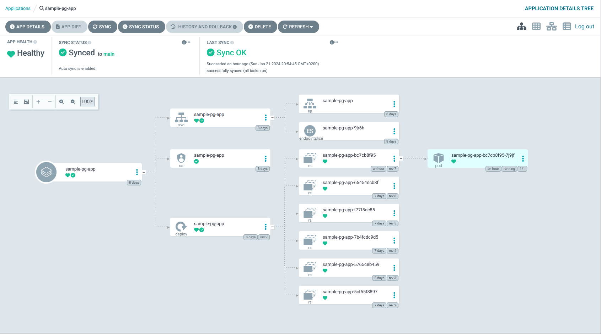

# Create A PostgreSQL Database

After initializing the environment, when [opening the Argo-CD web UI](../init-env/01_deploy_argocd.md#forward-traffic-to-argo-cd), you should see the root application, postgresql, ext-postgres-operator, and sample-pg-app:  



When opening the sample-pg-app, you should see the Kubernetes resources related to the sample-pg-app:  



Now, our sample-pg-app requires a database, to declare the database:

```yaml
apiVersion: db.movetokube.com/v1alpha1
kind: Postgres
metadata:
  name: sample-pg-app
  namespace: services
  annotations:
    argocd.argoproj.io/hook: PreSync # Executes prior to the application of the manifests.
spec:
  database: sample-pg-app # Name of database created in PostgreSQL
  dropOnDelete: false # Set to true if you want the operator to drop the database and role when this CR is deleted (optional)
```

Our sample-pg-app will also need a user name and password for authentication.  
We can declare a new user that will be associated with the database we've created:  

```yaml
apiVersion: db.movetokube.com/v1alpha1
kind: PostgresUser
metadata:
  name: sample-pg-app-auth
  namespace: services
spec:
  role: sample-user
  database: sample-pg-app-db       # This references the Postgres CR
  secretName: postgres
  privileges: OWNER     # Can be OWNER/READ/WRITE
```

