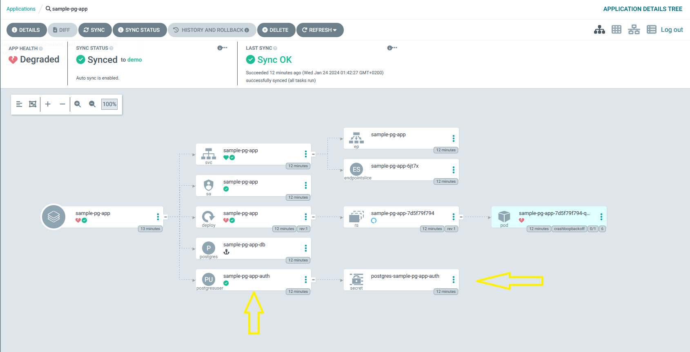

# Create PostgreSQL Credentials

In this slide we are going to provision a user and password for the database which will be stored in a Kubernetes secret, and configure our sample-pg-app to retrieve the authentication details from that secret.

We can declare a new user that will be associated to the database by creating the following `.yaml` in [apps/services/sample-pg-app/hooks](apps/services/sample-pg-app/hooks):  
> [!WARNING]  
> Again, make sure the file name you choose ends with `.yaml`, for example, `database-user.yaml`.

```yaml
apiVersion: db.movetokube.com/v1alpha1
kind: PostgresUser
metadata:
  name: sample-pg-app-auth
  namespace: services
spec:
  role: sample-user
  database: sample-pg-app-db       # This references the Postgres CR
  secretName: postgres
  privileges: OWNER     # Can be OWNER/READ/WRITE
```

Once you've pushed your changes, you should see a new _postgresuser_ and a Kubernetes secret:



Now let's reference the secret in the sample-pg-app.  

Add the following `values.yaml` file to [apps/services/sample-pg-app](apps/services/sample-pg-app)

```yaml
postgres:
  auth:
    secretName: "postgres-sample-pg-app-auth"
```


> [!NOTE]  
> You can see the default Helm values of sample-pg-app in [sample-pg-app/chart/sample-pg-app/values.yaml](sample-pg-app/chart/sample-pg-app/values.yaml)