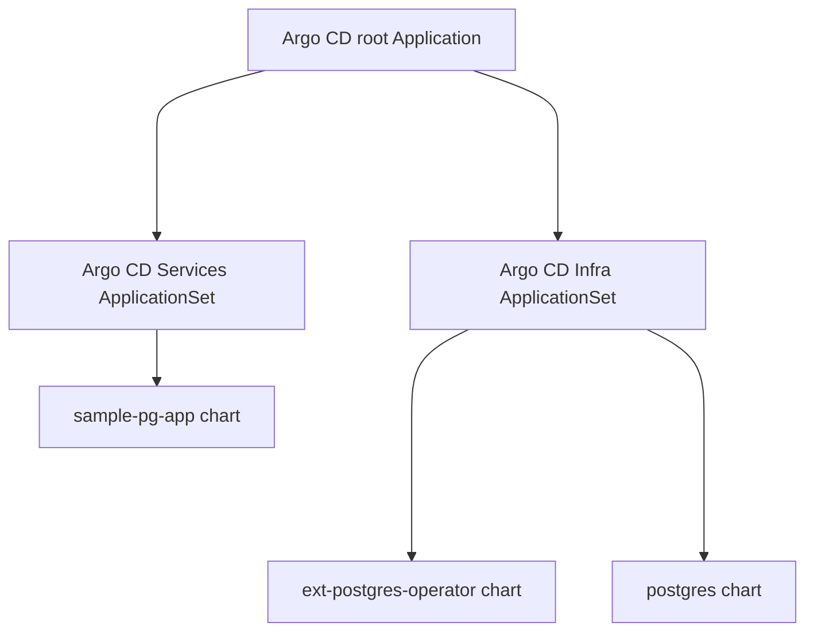

<br>

In this section we are going to apply a Custom Resource of kind _Application_ and learn about a Custom Resource of kind _Application Set_.  

Now that we have Argo CD deployed in our cluster, and we can access its web UI, we need to create an Argo CD application that tells Argo CD to sync manifests and helm charts from your repository.

## Argo CD Application

The _Application_ Custom Resource will tell Argo CD to deploy manifests under the [apps/app-sets](https://github.com/Tom-HA/k8s-operators-workshop/tree/main/apps/app-sets) directory.  
Since it is the first application that we deploy, and it tells Argo CD to deploy (child) manifests, we'll call it _root application_.

## Argo CD Application Set

The [app-sets](https://github.com/Tom-HA/k8s-operators-workshop/tree/main/apps/app-sets) directory contains
Custom Resources of kind _Application Set_.  
These Custom Resources will tell Argo CD to dynamically create _Applications_ according to the file structure in your repository.  
In our case, for each folder in the [infra folder](https://github.com/Tom-HA/k8s-operators-workshop/tree/main/apps/infra) and [services folder](https://github.com/Tom-HA/k8s-operators-workshop/tree/main/apps/services), create an _Application_ with the configuration in the .yaml files.  
For example, see the .yaml files in the [postgres folder](https://github.com/Tom-HA/k8s-operators-workshop/tree/main/apps/infra/postgres).  

### Flow



## Edit Argo CD Root Application

Before we apply the root application manifest, we need to set your repository's URL (assuming you forked the repository, if you didn't, please make sure you completed the steps in the [intro](../01_intro)).  
Open the [argocd-root-app.yaml](https://github.com/Tom-HA/k8s-operators-workshop/blob/main/init-env/values/argo-cd/argocd-root-app.yaml) manifest, and there, change the `repoURL` to your repository's URL.  

## Edit Argo CD Application sets

Open the [services-app-set.yam](https://github.com/Tom-HA/k8s-operators-workshop/blob/main/apps/app-sets/services-app-set.yaml) manifest and update every instance of `repoURL` to your repository's URL.

## Apply Argo CD Root Application

Now, after we've updated our manifests, we can apply our root application by executing:

```sh
kubectl apply -f ./values/argo-cd/argocd-root-app.yaml
```

## Review The New Resources

Now we can go to the Argo CD UI and see the new applications being provisioned in the cluster!  

From now on, we can go full GitOps!  
This means, no more manual `kubectl` commands, and every change to the manifests can be made by updating your repository.  

## Learn more

Congratulations! You've just deployed Argo CD and implemented the _App of Apps_ pattern, you can read more about this pattern in [Argo CD's documentation](https://argo-cd.readthedocs.io/en/stable/operator-manual/declarative-setup/#app-of-apps).
